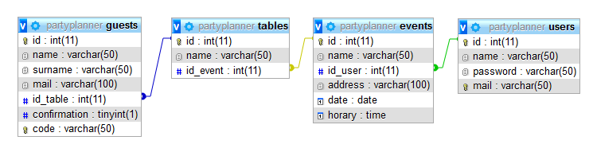

# PartyPlanner: Proyecto Final de Programación Web
Se desarrolló un sistema web que permite la creación de eventos/fiestas donde los invitados seran notificados **via mail** de la fiesta y con un codigo podrán controlar su asistencia a la fiesta.

## Requisitos
Para la lectura del codigo, con un editor de texto  es suficiente. Se recomienda **Sublime Text**.
Para correr el sistema web, es necesario un **paquete de software con sistema de gestion de SQL, PHP, y con un servidor web APACHE**. Se puede usar **XAMPP** sin problemas.

## Instalación

1.  En el caso de usar XAMPP, guardar los archivos en una carpeta creada para la prueba del sistema web (puede tener cualquier nombre) en:

		localhost/htdocs 

2. Importar al sistema de base de datos del sistema web el archivo *'partyplanner.sql'*. Se puede importar de manera cómoda desde **phpMyAdmin**. Para eso, ingresar a un navegador y luego dirigirse a:

	    localhost/phpmyadmin
	    
	Crear una base de datos con un nombre, y luego importar el archivo.

3. Configurar *'BaseDeDatos.php'*. Al ingresar al archivo, en las primeras líneas del código, se encontrará con lo siguiente:

```
    $servername = "localhost";
    $username = "";
    $password = "";
    $dbname = "";
```

**servername:** Ingresar entre las comillas en nombre del servidor. Por defecto, es localhost.

**username:** Ingresar entre las comillas el nombre de usuario para ingresar al servidor. Se recomienda entrar como *'root'* en el caso de usar XAMPP.

**password:** Ingresar entre las comillas la contraseña del usuario. Se recomienda dejarlo vacio en el caso de usar XAMPP.

**dbname:** Ingresar entre las comillas el nombre de la base de datos que creamos en el paso 2.

Si llego hasta el paso 3 sin problemas, la instalacion del sistema web esta terminada.

## Pruebas
Para poder probar el sistema web, primero hay que correr el XAMPP (el MAMP o cualquier otro paquete de software que se usando) y activamos el servidor web APACHE y el gestor de base de datos.

Luego ir a un navegador y dirigirse a 

		localhost/CarpetaDePrueba

**NOTA: En el caso de arriba se supone que la carpeta creada en el paso 1 de la instalacion se llama *'CarpetaDePrueba'*. Se pide hacer la prueba segun lo realizado en la instalación.**

## Descripción de la base de datos

<div align='center'></div>


La base de datos diseñada para este proyecto esta formada por 4 tablas. A continuación se las describe:

### Guests (invitados):

 1. **id (numero):** Numero para la identificación del invitado en toda la base de datos.
 2. **name (texto):** Nombre del invitado.
 3. **surname (texto):** Apellido del invitado.
 4. **mail (texto):** Mail del invitado.
 5. **id_table (numero, clave foránea):** Numero de identificación de la mesa del usuario.
 6. **confirmation (booleano):** Si es *true*, el usuario confirmo su asistencia. Sino, es *false*.
 7. **code (texto):** Codigo para que el invitado pueda, desde la pagina, confirmar su asistencia.
 
 *Ejemplo de fila:*
 
|id  |name  |surname  |mail                      |id_table  |confirmation|code    |
|----|------|---------|--------------------------|----------|------------|--------|
|45  |Lucas |Saavedra |lucasarielsaavedra@hotmail|23        |1           |95959441|

### Tables (mesas):

 1. **id (numero):** Numero para la identificación de la mesa en la base de datos.
 2. **name (texto):** Nombre de la mesa.
 3. **id_event (numero, clave foránea):** Numero de identificación del evento de la mesa.

*Ejemplo de fila:*

|id  |name  |id_event  |
|----|------|----------|
|23|Mesa Principal | 10|

### Events (Eventos):

 1. **id (numero):** Numero para la identificación del eventos en toda la base de datos.
 2. **name (texto):** Nombre del evento.
 3. **id_user (numero, clave foránea):** Numero de identificación del usuario que creó el evento.
 4. **address (texto):** Dirección donde se hará el evento.
 5. **date (fecha):** Fecha en que se hará el evento.
 6. **horary (hora):** Hora en que se hará el evento.
  
 
 
  *Ejemplo de fila:*
  
|id  |name  |id_user  |address  |date  |horary  |
|----|------|---------|---------|------|--------|
|10|Fiesta de XV  |1  |Pueyrredon 1944 |2019-05-2 |17:00 |

### Users (usuarios):

 1. **id (numero):** Numero para la identificación del usuario en la base de datos.
 2. **name (texto):** Nombre del usuario.
 3. **password (texto):** Contraseña del usuario.
 4. **mail (texto):** Correo electrónico del usuario.
 

  *Ejemplo de fila:*
  
|id  |name  |password  |mail  |
|----|------|----------|------|
|1|nacho1023  |202cb962ac59075b964b07152d234b70  |prueba@prueba.com|

## Desarrollado con:
 - [Sublime Text 3](https://www.sublimetext.com/) - Editor de texto
 - [XAMPP](https://www.apachefriends.org/index.html)/[MAMP](https://www.mamp.info/en/) (Para Windows y Apple, respectivamente) - Paquetes de Software para el desarrollo con PHP.

## Desarrollado por:
 - Lucas Ariel Saavedra
 - Ignacio Tornati